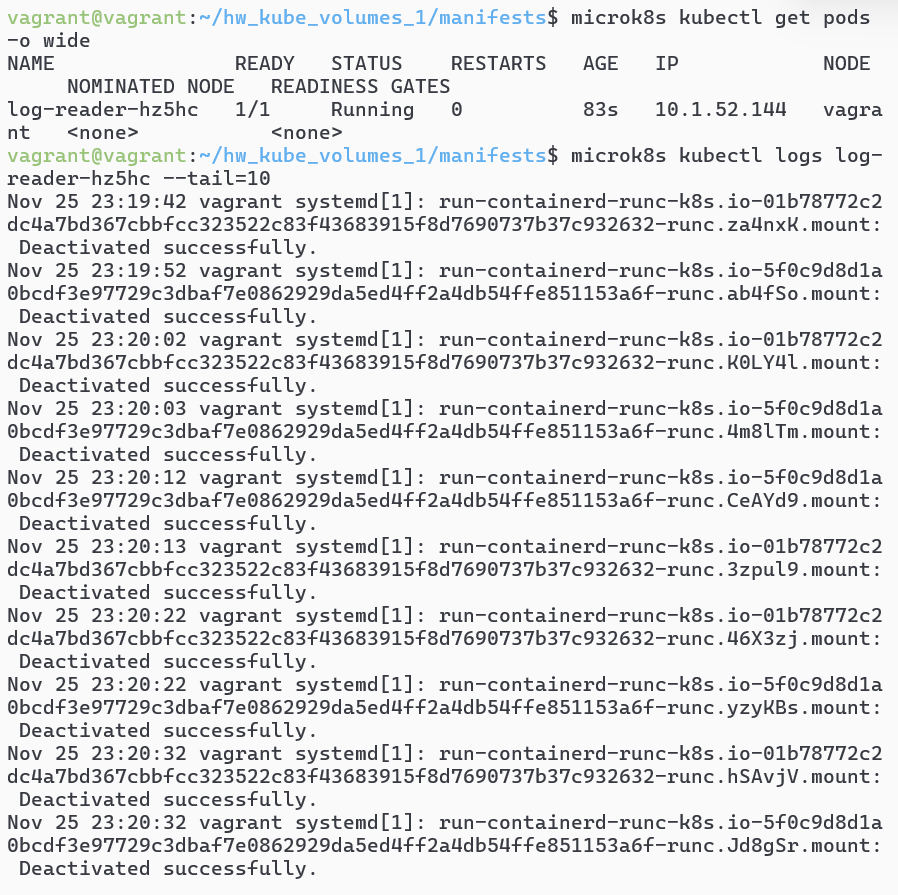

# Домашнее задание к занятию «Хранение в K8s. Часть 1»- Михалёв Сергей

### Цель задания

В тестовой среде Kubernetes нужно обеспечить обмен файлами между контейнерам пода и доступ к логам ноды.

------

### Задание 1 

**Что нужно сделать**

Создать Deployment приложения, состоящего из двух контейнеров и обменивающихся данными.

1. Создать Deployment приложения, состоящего из контейнеров busybox и multitool.
2. Сделать так, чтобы busybox писал каждые пять секунд в некий файл в общей директории.
3. Обеспечить возможность чтения файла контейнером multitool.
4. Продемонстрировать, что multitool может читать файл, который периодоически обновляется.
5. Предоставить манифесты Deployment в решении, а также скриншоты или вывод команды из п. 4.

------

**Решение**

Создал Deployment приложения [deploy_1.yaml](manifests/deploy_1.yaml), состоящего из контейнеров busybox и multitool. 

busybox пишет каждые пять секунд в файл `/data/timestamps.txt` в общей директории `/data`:

```
while true; do
  echo "$(date)" >> /data/timestamps.txt;
  sleep 5;
done;

```

multitool читает содержимое файла /data/timestamps.txt и отображает его в логах каждые 5 секунд.

```
while true; do
  clear;
  echo "Reading file:";
  cat /data/timestamps.txt || echo "File not found";
  sleep 5;
done;
```

Проверяю чтение даннх контейнером multitool через чтение логов: 

`kubectl logs -f deployment/multi-container-app -c multitool`

</br>

Никто не мешает проверить содиржимое тома прямо в контейнере multitool: 

`microk8s kubectl exec -it pod/multi-container-app-756c8c6cf6-hwdsc -c multitool -- sh`

</br>

-----

### Задание 2

**Что нужно сделать**

Создать DaemonSet приложения, которое может прочитать логи ноды.

1. Создать DaemonSet приложения, состоящего из multitool.
2. Обеспечить возможность чтения файла `/var/log/syslog` кластера MicroK8S.
3. Продемонстрировать возможность чтения файла изнутри пода.
4. Предоставить манифесты Deployment, а также скриншоты или вывод команды из п. 2.

------

**Решение**

Создал DaemonSet приложение [log-reader-daemonset.yaml](manifests/log-reader-daemonset.yaml), состоящеее из multitool.

multitool каждые 10 секунд считывает содержимое файла /host-logs/syslog и выводит его в лог:

```
while true; do
  echo "Reading /var/log/syslog:";
  cat /host-logs/syslog || echo "Log file not found";
  sleep 10;
done;
```

Том host-logs типа hostPath подключает директорию `/var/log` хоста к директории `/host-logs` внутри контейнера. Указывая `readOnly: true` защищаем хостовые данные от записи.

Получил список подов: `microk8s kubectl get pods -o wide`

Вывел последние 10 строчек логов пода: `microk8s kubectl logs log-reader-hz5hc --tail=10 -f`

</br>

------
